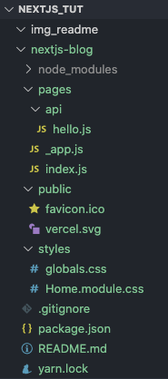
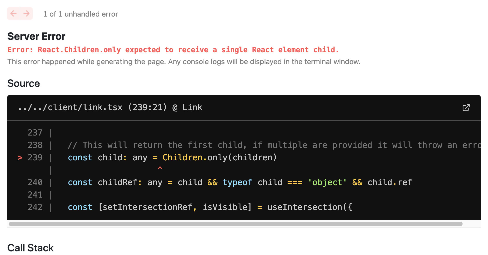
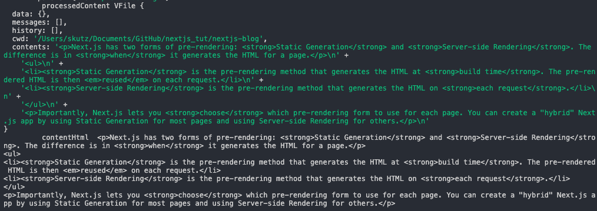

##### Setup

1) 1) From target project folder, run either:

    ~~~ bash
    yarn create next-app nextjs-blog
    ~~~

    or

    ~~~ bash
    npx create-next-app nextjs-blog --use-npm --example "https://github.com/vercel/next-learn-starter/tree/master/learn-starter"

    ~~~

   - the following file setup is created

        

2) Key features:

    - files that reside with the `pages` folder are automatically associated with a route based on the filename. Therefore, every page becomes a file which itself is a React Component.

      - pages defined with square brackets represent dynamic routes(/pages/users/[id].js  >>  users/user/1 ,  users/user/2 , ...). Query parameters are merged into a path parameters that Next.js tries to match to a route. The `/` route is associated with `pages/index.js`

    - Within a page, `props` and `dynamic routes` can be `pre-rendered`(e.g. data fetched at build time) using `getStaticProps` & `getStaticPaths` respectively

    - `_app.js allows overrriding the `App` component which is used to initialize pages`
      - the current active page is represented by the `Component` prop and any props sent with the page. Navigating to a new page is representing by its unique `Component` prop.
      - `pageProps` are any props preloaded via a Next.js data fetching method

        ~~~ js
        function MyApp({ Component, pageProps }) {
            return <Component {...pageProps} />
        }
        ~~~

    - `_document.js` allows appending styling functionality from a `css-in-js` styling library(e.g. Material-UI, Tailwind CSS, etc.) into the application's <html> & <body> tags. This essentially wraps the app with the styling framework to allow proper server side rendering. Basically styles from the stying library are injected into the document when the page is loaded and during hydration/hot module reloading.

    - Files located within the `/api` folder get mapped to `/api/*` and behave as API endpoints

    - Changes made to files that export only React components will quickly update the Next.js development server. This means that changes will be reflected in the browser almost immediately. This feature is called `Fast Refresh` and is enabled by default.

3) Launch the default  `Next.js` app using  either:
   
    ~~~ bash
    npm run dev
    ~~~

    ~~~ bash
    yarn dev
    ~~~

##### Adding pages and links

- use the Next.js `Link` component to do client-side navigation by wrapping `<a>` tags

1) Modify the `pages/index.js` file:

    ~~~ js
    import Link from 'next/link'; //add this

    ...
    // Learn <a href="https://nextjs.org">Next.js!</a> // change this to

    Read <Link href = "/posts/first-post"><a> this page </a></Link>   

    ~~~

   - NOTE: spaces around `Link` cause an unusual error:

    

  
2) Create posts/first-post.js :

    - Next.js will use `code splitting` to load only what is required for the page render
    - in production, React.js `prefetches` pages referenced in `Link` components
   - NOTE: inclusion of pages/_app.js removes anchor tag formatting on first-post page

        
    
    - If CSS is required, add using className to the `a` tag, NOT the `Link` tag
    - Use `a` tags to link to external content

    ~~~ js
    import Link from 'next/link';

    import Link from 'next/link';

    export default function FirstPost() {
        return (
            

                <h1> First Post Page </h1>
                <h2> 
                    <Link href = "/">
                        <a> Back to Home page </a>
                    </Link>            
                </h2> 
            

        )
    }

    ~~~

##### Assets, Metadata, CSS

- Next.js serves static files from the `public` directory. The file referenced by `src="/vercel.svg"` exists within the `public` directory

- the `Head` component is part of Next.js. The tab of the first-post page will display the title given to the `Head` component.

    ~~~ js
    import Head from 'next/head'

    ...

    

        <Head>
            <title> First Post Title </title>            
        </Head>

        <h1> First Post Page </h1>

    ~~~

- Next.js supports the `CSS-in-JS` library `styled-jsx` that permits scoped styling. This means that other similarly referenced components do not inherit attributes as with typical CSS rules. Instead, unique class names are generated for each JSX element

1) Set up styling for first-post.js

   - create `components/layout.module.css`

        ~~~ js
        .container {
            max-width: 36rem;
            padding: 0 1 rem;
            margin: 3rem auto 6 rem;
            border: 1px solid deeppink;
        }
        ~~~

    - create `components/layout.js`
        ~~~ js

        import styles from './layout.module.css'

        export default function Layout({children}) {
            return 
 {children} 

        }
        ~~~

    - modify pages/first-post.js

        ~~~ js
        import Link from 'next/link'
        import Head from 'next/head'
        import Layout from '../../components/layout'

        export default function FirstPost() {
            return (
                <Layout>
                    <Head>
                        <title> First Post Title </title>            
                    </Head>

                    <h1> First Post Page </h1>
                    <h2> 
                        <Link href = "/">
                            <a> Back to Home page </a>
                        </Link>            
                    </h2> 
                </Layout>

            )

        }
        ~~~

2) Global styling can be implemented by adding `_app.js` to the `pages` folder

    - create `_app.js`
    - the component name does not have to be MyApp

        ~~~ js
        import '../styles/globals.css'

        function MyApp({ Component, pageProps }) {
            return <Component {...pageProps} />
        }

        export default MyApp
        ~~~

3) Adding styled-jsx to index.js starts to cause attributes to override each other

    ~~~ jsx
        
    ~~~

4) To create an avatar for the home page

    - save an image to public/images

    - append to `layout.module.css`

        ~~~ css
        .container {
        max-width: 36rem;
        padding: 0 1rem;
        margin: 3rem auto 6rem;
        }

        .header {
        display: flex;
        flex-direction: column;
        align-items: center;
        }

        .headerImage {
        width: 6rem;
        height: 6rem;
        }

        .headerHomeImage {
        width: 8rem;
        height: 8rem;
        }

        .backToHome {
        margin: 3rem 0 0;
        }
        ~~~

    - create `styles.utils.module.css`

        ~~~ css
        .heading2Xl {
        font-size: 2.5rem;
        line-height: 1.2;
        font-weight: 800;
        letter-spacing: -0.05rem;
        margin: 1rem 0;
        }

        .headingXl {
        font-size: 2rem;
        line-height: 1.3;
        font-weight: 800;
        letter-spacing: -0.05rem;
        margin: 1rem 0;
        }

        .headingLg {
        font-size: 1.5rem;
        line-height: 1.4;
        margin: 1rem 0;
        }

        .headingMd {
        font-size: 1.2rem;
        line-height: 1.5;
        }

        .borderCircle {
        border-radius: 9999px;
        }

        .colorInherit {
        color: inherit;
        }

        .padding1px {
        padding-top: 1px;
        }

        .list {
        list-style: none;
        padding: 0;
        margin: 0;
        }

        .listItem {
        margin: 0 0 1.25rem;
        }

        .lightText {
        color: #999;
        }
        ~~~

    - update `layout.js`

        ~~~ js
        import Head from 'next/head'
        import styles from './layout.module.css'
        import utilStyles from '../styles/utils.module.css'
        import Link from 'next/link'

        const name = 'Nextjs Dude'
        export const siteTitle = 'Next.js Sample Website'

        export default function Layout({ children, home }) {
        return (
            

            <Head>
                <link rel="icon" href="/favicon.ico" />
                <meta
                name="description"
                content="Learn how to build a personal website using Next.js"
                />
                <meta
                property="og:image"
                content={`https://og-image.now.sh/${encodeURI(
                    siteTitle
                )}.png?theme=light&md=0&fontSize=75px&images=https%3A%2F%2Fassets.vercel.com%2Fimage%2Fupload%2Ffront%2Fassets%2Fdesign%2Fnextjs-black-logo.svg`}
                />
                <meta name="og:title" content={siteTitle} />
                <meta name="twitter:card" content="summary_large_image" />
            </Head>
            <header className={styles.header}>
                {home ? (
                <>
                    
                    <h1 className={utilStyles.heading2Xl}>{name}</h1>
                </>
                ) : (
                <>
                    <Link href="/">
                    
                    </Link>
                    <h2 className={utilStyles.headingLg}>
                    <Link href="/">
                        <a className={utilStyles.colorInherit}>{name}</a>
                    </Link>
                    </h2>
                </>
                )}
            </header>
            <main>{children}</main>
            {!home && (
                

                <Link href="/">
                    <a>← Back to home</a>
                </Link>
                

            )}
            

        )
        }
        ~~~

    - update `pages/index.js`    

        ~~~ js
            import Head from 'next/head'
            import Layout, { siteTitle } from '../components/layout'
            import utilStyles from '../styles/utils.module.css'

            export default function Home() {
            return (
                <Layout home>
                <Head>
                    <title>{siteTitle}</title>
                </Head>
                <section className={utilStyles.headingMd}>
                    
 You know, if it wasn't for the existential terror of staring into a void of space, 
                    I'd say I'm feeling better today. The infection's run its course, Thanks to the blue 
                    meanie back there. World governments are in pieces. The parts that are still working 
                    are trying to take a census. And it looks like he did... he did exactly what he said 
                    he was gonna do. Thanos wiped out fifty percent, of all living creatures 

                    

                    (This is a sample website - you’ll be building a site like this on{' '}
                    <a href="https://nextjs.org/learn">our Next.js tutorial</a>.)
                    

                </section>
                </Layout>

        ~~~

##### Handling Data

- `Next.js` implements `pre-rendering` HTML and the minimal amount of JavaScript(e.g. event handlers, etc.) for all pages as opposed to using the rendering from the browser as with `client-side` rendering. In fact, disabling JavaScript in your browser will not prevent the app from rendering pages as would happen with a simple React app.
- Next.js defines two types of `pre-rendering`:
    - Static Generation: generated at build time & reused on repeat requests(good whenever content is less likely to be updated)
      - There are two types of Static Generation:
          - Static Generation Without Data: fetching page data is not required at build time
          - Static Generation With Data: data must be fetched at build time. Data is fetched asynchronously using `getStaticProps` at build time in production and passed in as page props.   
    - SSR(Server-side rendering: generated at time of page request(good when page data is updated often)
- In development mode, ALL pages are pre-rendered and `getStaticProps` is called for each page request
- A 'hybrid' app uses both types of `pre-rendering`
- When a page loads, all of the JavaScript code runs to create a dynamic and interactive page. This process is called `hydration`. Basically, this process will activate of the app's React components

1) Create a `posts` folder in the project directory and add two files: 

    - `YAML front matter` is contained within the `---` section of each file. This metadata that can be read using a library called `gray-matter`. `YAML` is a type of markup often noted for being easy to read and is often used in configuration files for servers, operations systems, app, etc.
    - Install `gray-metter` via the terminal `npm install gray-matter`

   - `pre-rendering.md`

        ~~~ md
        ---
        title: 'Two Forms of Pre-rendering'
        date: '2020-01-01'
        ---

        Next.js has two forms of pre-rendering: **Static Generation** and **Server-side Rendering**. The difference is in **when** it generates the HTML for a page.

        - **Static Generation** is the pre-rendering method that generates the HTML at **build time**. The pre-rendered HTML is then _reused_ on each request.
        - **Server-side Rendering** is the pre-rendering method that generates the HTML on **each request**.

        Importantly, Next.js lets you **choose** which pre-rendering form to use for each page. You can create a "hybrid" Next.js app by using Static Generation for most pages and using Server-side Rendering for others.

        ~~~

    - `ssg,ssr.md`

        ~~~ md
        ---
        title: 'When to Use Static Generation v.s. Server-side Rendering'
        date: '2020-01-02'
        ---

        We recommend using **Static Generation** (with and without data) whenever possible because your page can be built once and served by CDN, which makes it much faster than having a server render the page on every request.

        You can use Static Generation for many types of pages, including:

        - Marketing pages
        - Blog posts
        - E-commerce product listings
        - Help and documentation

        You should ask yourself: "Can I pre-render this page **ahead** of a user's request?" If the answer is yes, then you should choose Static Generation.

        On the other hand, Static Generation is **not** a good idea if you cannot pre-render a page ahead of a user's request. Maybe your page shows frequently updated data, and the page content changes on every request.

        In that case, you can use **Server-Side Rendering**. It will be slower, but the pre-rendered page will always be up-to-date. Or you can skip pre-rendering and use client-side JavaScript to populate data.

        ~~~

2)  Create a `lib` folder and add the `posts.js` file

- this will fetch and sort file system data for the app to `pre-render`      

    ~~~ js
    import fs from 'fs'  // A Node.js module for file-system operations
    import path from 'path' // A Node.js module for navigating different OS file systems
    import matter from 'gray-matter' // used to read YAML front matter

    // The path.join() method joins all given path segments together 
    // using the platform-specific separator as a delimiter, then normalizes the resulting path.
    //    process.cwd() gets the current working directory
    const postsDirectory = path.join(process.cwd(), 'posts')

    export function getSortedPostsData() {
        // Get the filenames from /posts MD files by reading dir contents synchronously, (blocks other code until done)
        const fileNames = fs.readdirSync(postsDirectory)

        // map into an array
        const allPostsData = fileNames.map(fileName => {
            // truncate .md suffix
            //const id = fileName.replace(/\.md$/, '')
            const id = fileName(0, fileName.length - 3)

            // read markdown as a string
            //          reads file contents synchronously (blocks other code until done)
            const fullPath = path.join(postsDirectory, fileName)
            const fileContents = fs.readFileSync(fullPath, 'utf8')

            // let gray-matter parse post metadata section
            const matterResult = matter(fileContents)

            // merge data with id
            return {
                id, 
                ...matterResult.data
            }
        })

        // NOW, return sorted allPostsData
        return allPostsData.sort((a,b) => {
            if (a.date < b.date) {
                return 1
            } else {
                return -1
            }
        })

    }
    ~~~

3) Use `getStaticProps` to pass in posts data as props to the `Home` component of `pages/index.js`    

   - `getSortedPostsData()` is used to within `getStaticProps` to fetch data passed in as the prop `allPostsData` into the `Home` component 

     ~~~ js
     ...
     import {getSortedPostsData} from './lib/posts'

     export default function Home({allPostsData}) {
        return (
        <Layout home>

            <section className = {`${utilStyles.headingMd} ${utilSytels.padding1px}`}>
                    <h2 className = {utilStyles.headingMd}></h2>
                    <ul className = {utilStyles.list}>
                    {allPostsData.map(({id, date, title}) => (
                        <li className = {utilStyles.listItems} key = {id}>
                        {title}
                         
                        {id}
                         
                        {date}
                        </li>
                    ))}
                    </ul>      
                </section>
        </Layout>
        )
     }

     export async function getStaticProps() {
        const allPostsData = getSortedPostsData()
        return {
        props: {
            allPostsData
        }
        }
     }
     ~~~

##### Dynamic Routes

- Surrounding a page name with [ ] tells Next.js that this a dynamic route.
- This page uses `getStaticPaths` to return an obj containing parameters that define specific routes(e.g. provides list a of id values as obj for `route posts/<id>`)
- This page uses `getStaticProps` to provide the specific data to render the page
- the `Layout` component is like a template for how pages rendered for the dynamic routes should look

1) Add these functions to `pages/posts.js`

    ~~~ js
    // this will get id values for a specific post page
    //              used by getStaticPaths in [id].js
    export function getAllPostIds () {
        const fileNames = fs.readdirSync(postsDirectory)

        return fileNames.map(fileName => {
            return {
                // MUST return an obj NOT a string for id
                params: {
                    id: fileName.substr(0, fileName.length - 3)
                //  id: fileName.replace(/\.md$/, '')
                }
            
            }
        
        })

    }

    // this will get all page data that matches the id
    //              used by getStaticProps in [id].js

    export function getPostData(id) {
        const fullPath = path.join(postsDirectory, `${id}.md`)
        const fileContents = fs.readFileSync(fullPath, 'utf8')

        // Use gray-matter to parse post metadata section for a given id
        const matterResult = matter(fileContents)

        // Merge id with corresponding data
        return {
            id,
            ...matterResult.data
        }
    ~~~

2) Create `posts/[id].js` 

   - this file must include:
        -  a React component that uses a prop returned from `getStaticProps`
        -  a `getStaticPaths` function that returns an array of obj that must include  `path` & `required` keys. 
           - The `path` key itself contains an array of obj that describe key-value pairs for page parameters. The obj will use the same key as the filename used within the square brackets of [`filename`].js For example, [`id`].js would correspond to a route parameters array obj keys of the form  {`id`: 1, `id`: 2, ...}
           - The `required` key is a boolean and returns a `404` message when set to false. Setting  to true is used for incrementally loading pages. The setting ``fallback: 'blocking'` is used to emulate the behavior  of SSR.
        - a `getStaticProps` function that returns a `props` obj that is serializable(e.g. can convert the format of an obj into a byte-stream string). This props obj is passed into the React component used to render the dynamic pages. 

   - Remember to `destructure` the `postData` prop passed in to the `Post` component(e.g. Post({postData}) NOT  Post(postData))

        ~~~ js
        import Layout from '../../components/layout'
        import {getAllPostIds, getPostData} from '../../lib/posts'

        // postData prop passed in from getStaticProps
        export default function Post({postData}) {
            
            console.log('postData ', postData)    

            return (
                <Layout>
                    {postData.title}
                     
                    {postData.id}
                     
                    {postData.date}
                </Layout>
            )

        }

        // Must include getStaticPaths
        export async function getStaticPaths() {
            const paths = getAllPostIds()

            console.log(">>> paths ", paths)    
            // paths  [ { params: { id: 'pre-rendering' } }, { params: { id: 'ssg-ssr' } } ]

            return {
                paths, 
                fallback: false // required
            }

        }

        // Must also include getStaticProps
        export async function getStaticProps({params}) {
            console.log(" >>>>>> params ", params)
            // >>>>>> params  { id: 'ssg-ssr' }
            
            const postData = getPostData(params.id)
            console.log('getStatic ', postData)
            // getStatic  {
            // id: 'ssg-ssr',
            // title: 'When to Use Static Generation v.s. Server-side Rendering',
            // date: '2020-01-02'
            // }

            return {
                props: {
                    postData
                }
            }

        }
        ~~~

##### Displaying markdown in dynamically rendered pages

  - Content from the markdown file after the `YAML front matter` is parsed into lines of `HTML sentences` and then concatenated into a string of HTML. This HTML string is rendered from the `postData` prop passed into the `Post` component in [id].js

    

1) Install `remark` and `remark-html` via `yarn add remarl remark-html`

2) Modify `pages/posts.js`

    - notice that `async` is added to the `getPostData` function
  
        ~~~ js
        ...
        import remark from 'remark'     // parse markdown
        import html from 'remark-html'  // serializes Markdown as HTML
        ...
        export async function getPostData(id) {
            const fullPath = path.join(postsDirectory, `${id}.md`)
            const fileContents = fs.readFileSync(fullPath, 'utf8')

            // Use gray-matter to parse post metadata section for a given id
            const matterResult = matter(fileContents)

            // the metadata is processed further 
            // Use remark to convert the parsed markdown into HTML 
            const processedContent = await remark()
                .use(html)
                .process(matterResult.content)

            // console.log("\t processedContent", processedContent)        

            // convert HTML to string
            const contentHtml = processedContent.toString()
            // console.log("\t contentHtml ", contentHtml)

            // Merge id with corresponding data
            return {
                id,
                contentHtml,
                ...matterResult.data,
            }

        }
        ~~~

3) Modify [id].js  to render the parsed out markdown as HTML

    - `dangerouslySetInnerHTML` is a special React syntax for displaying HTML from code. This can sometimes lead to XSS(Cross-site scripting) attacks if user data input from a site is used to generate HTML. A module called `DOMPurify can be used` to mitigate risks of XSS.

        ~~~ js
        <Layout>
            {postData.title}
             
            {postData.id}
             
            {postData.date}
             
            

        </Layout>
        ~~~

###### Enhancing Styling for Dynamic Pages        

1) Create components/date.js

    - install `date-fns` via `yarn install date-fns`

        ~~~ js
        import {parseISO, format} from 'date-fns'

        export default function Date({dateString}) {
            const date = parseISO(dateString)
            return <time dateTime = {dateString}>{format(date, 'EEEEE LLLL d, yyyy')}</time>

        }
        ~~~

2) Modify `posts/[id].js`

    ~~~ js
    ...
    import Head from 'next/head'
    import Date from '../../components/date'
    import utilStyles from '../../styles/utils.modules.css'

    // postData prop passed in from getStaticProps
    export default function Post({postData}) {
        
        console.log('postData ', postData)    

        return (
            <Layout>
                <Head>
                    <title>postData.title</title>
                </Head>
                <article>
                    <h1 className={utilStyles.headingXl}>{postData.title}</h1>
                    

                    <Date dateString={postData.date} />
                    

                    

                </article>

            </Layout>
        )

    }
    ...
    ~~~